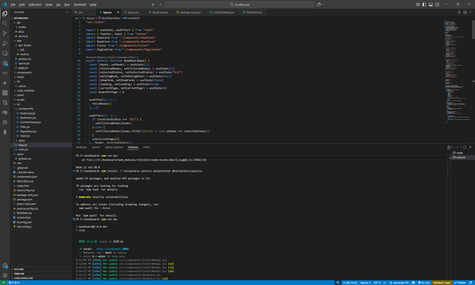
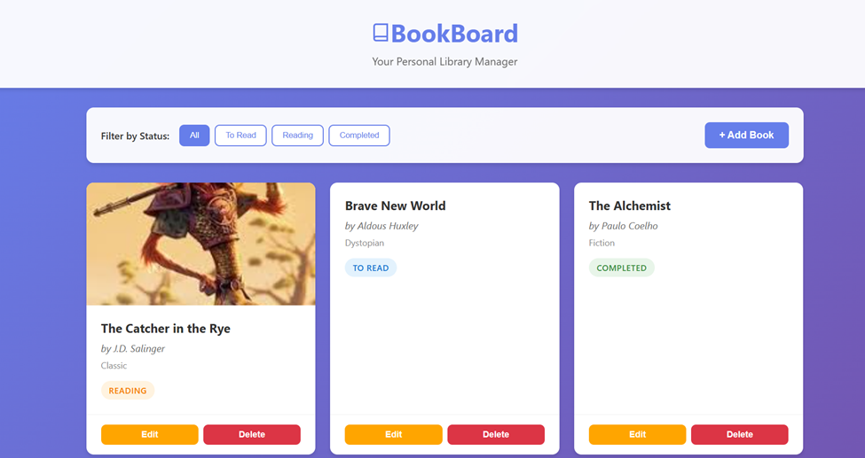
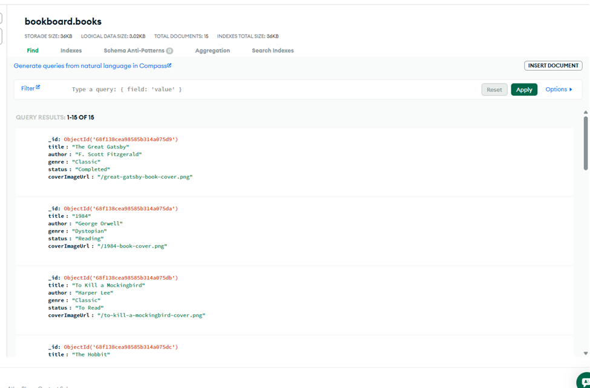

# 📚 BookBoard

web application for managing your personal book library. Built with React + Vite, Express, and MongoDB.

## Features

- ✨ **Full CRUD Operations**: Create, Read, Update, and Delete books
- 🎨 **Beautiful UI**: Modern, responsive design with smooth animations
- 🏷️ **Status Tracking**: Track books as "To Read", "Reading", or "Completed"
- 🔍 **Filter Books**: Filter your library by reading status
- 📱 **Fully Responsive**: Works seamlessly on desktop, tablet, and mobile
- 🖼️ **Cover Images**: Optional book cover image support

## Tech Stack

- **Frontend**: React 18 + Vite (JSX)
- **Backend**: Node.js + Express
- **Database**: MongoDB + Mongoose
- **Styling**: Pure CSS with modern design patterns

## Project Structure

\`\`\`
bookboard/
├── package.json
├── vite.config.js
├── .env
├── .env.example
├── api/
│   ├── server.js          # Express server
│   ├── db.js              # MongoDB connection & schema
│   └── routes/
│       └── books.js       # CRUD API routes
├── src/
│   ├── main.jsx           # React entry point
│   ├── App.jsx            # Main app component
│   ├── components/
│   │   ├── BookCard.jsx   # Book display card
│   │   ├── BookForm.jsx   # Add/Edit form
│   │   └── Filter.jsx     # Status filter
│   └── styles/
│       └── main.css       # All styles
├── scripts/
│   └── seed.js            # Database seeding script
└── README.md
\`\`\`

## Installation & Setup

### Prerequisites

- Node.js (v16 or higher)
- MongoDB (local installation or MongoDB Atlas account)

### Step 1: Clone the Repository

\`\`\`bash
git clone <repository-url>
cd bookboard
\`\`\`

### Step 2: Install Dependencies

\`\`\`bash
npm install
\`\`\`

### Step 3: Configure Environment Variables

Create a `.env` file in the root directory:

\`\`\`env
MONGODB_URI=mongodb://localhost:27017/bookboard
PORT=5000
\`\`\`

**For MongoDB Atlas:**
Replace the `MONGODB_URI` with your Atlas connection string:
\`\`\`env
MONGODB_URI=mongodb+srv://<username>:<password>@cluster.mongodb.net/bookboard
\`\`\`

### Step 4: Start MongoDB (if using local installation)

\`\`\`bash
# macOS/Linux
mongod

# Windows
"C:\Program Files\MongoDB\Server\<version>\bin\mongod.exe"
\`\`\`

### Step 5: Seed the Database (Optional)

Populate your database with 15 sample books:

\`\`\`bash
npm run seed
\`\`\`

This will add a variety of books across different genres and reading statuses to help you get started quickly.

### Step 6: Run the Application

**Option 1: Run both servers concurrently (recommended)**
\`\`\`bash
npm start
\`\`\`

**Option 2: Run servers separately**

Terminal 1 (Backend):
\`\`\`bash
npm run server
\`\`\`

Terminal 2 (Frontend):
\`\`\`bash
npm run dev
\`\`\`

### Step 7: Access the Application

Open your browser and navigate to:
\`\`\`
http://localhost:3000
\`\`\`

The API server runs on `http://localhost:5000`

## Available Scripts

| Script | Description |
|--------|-------------|
| `npm start` | Run both frontend and backend concurrently |
| `npm run dev` | Run frontend development server only |
| `npm run server` | Run backend API server only |
| `npm run seed` | Populate database with sample books |
| `npm run build` | Build frontend for production |
| `npm run preview` | Preview production build |

## API Endpoints

| Method | Endpoint | Description |
|--------|----------|-------------|
| GET | `/api/books` | Get all books |
| GET | `/api/books/:id` | Get single book |
| POST | `/api/books` | Create new book |
| PUT | `/api/books/:id` | Update book |
| DELETE | `/api/books/:id` | Delete book |

## Usage

### Adding a Book

1. Click the "+ Add Book" button
2. Fill in the book details (title, author, genre are required)
3. Optionally add a cover image URL
4. Select the reading status
5. Click "Add Book"

### Editing a Book

1. Click the "Edit" button on any book card
2. Modify the book details
3. Click "Update Book"

### Deleting a Book

1. Click the "Delete" button on any book card
2. Confirm the deletion

### Filtering Books

Use the filter buttons at the top to view:
- All books
- Books to read
- Books currently reading
- Completed books

## Sample Data

The seed script includes 15 diverse books:
- Classic literature (The Great Gatsby, 1984, To Kill a Mockingbird)
- Fantasy novels (The Hobbit, Harry Potter, The Lord of the Rings)
- Contemporary fiction (The Midnight Library, The Alchemist)
- Non-fiction (Sapiens, Atomic Habits, Educated)
- Thrillers (The Silent Patient)

Each book has a cover image, genre, and reading status to demonstrate the full functionality of the app.

## Troubleshooting

### MongoDB Connection Issues

- Ensure MongoDB is running
- Check your connection string in `.env`
- Verify network access if using MongoDB Atlas

### Dependencies Issues

\`\`\`bash
# Clear node_modules and reinstall
rm -rf node_modules package-lock.json
npm install
\`\`\`

### Seed Script Issues

If the seed script fails:
- Verify MongoDB is running and accessible
- Check your `MONGODB_URI` in `.env`
- Ensure you have write permissions to the database

Built with  using React, Express, and MongoDB

