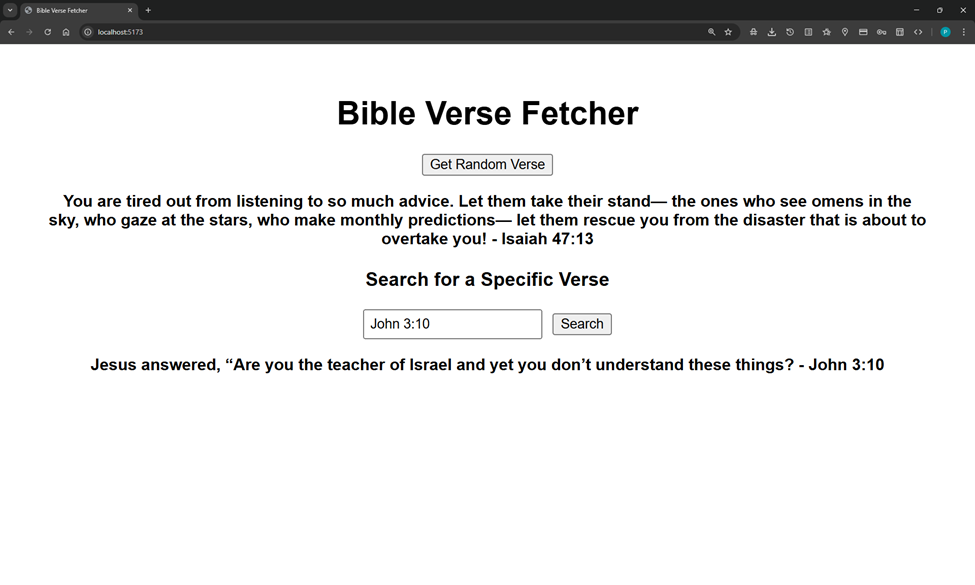

# Bible Verse Vite App

This is a simple React + Vite app that fetches random and specific Bible verses from the [labs.bible.org API](https://labs.bible.org/api_web_service).

## Features
- Click a button to fetch a random verse
- Enter a passage (e.g., `John 3:16`) to fetch a specific verse
- Simple and clean UI

## How to Run
1. Install dependencies:
   ```bash
   npm install
   ```


   ```bash
   npm install
   ```

   Then start the dev server:

   ```bash
   npm run dev
   ```


2. Start the dev server:
   ```bash
   npm run dev
   ```

3. Open the URL in your terminal (usually http://localhost:5173).

## Example API Calls
- Random: `https://labs.bible.org/api/?passage=random&type=json`
- Specific: `https://labs.bible.org/api/?passage=John%203:16&type=json`


