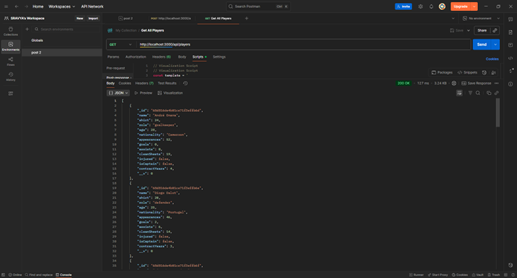
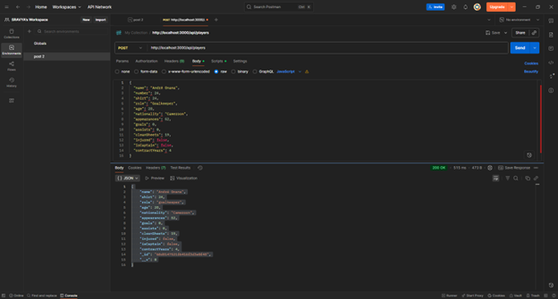
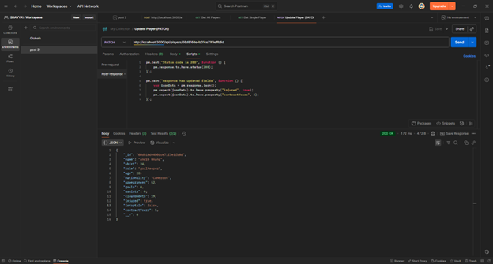
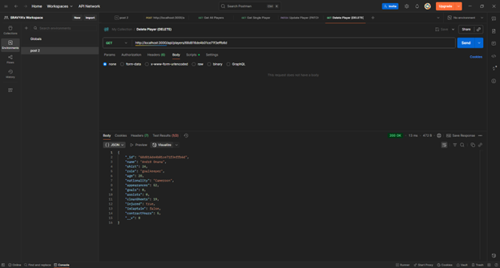

# Postman Part-2 API Project  

This project follows the tutorial from [CSC560 Node API Guide](https://github.com/aschneider15/CSC560-Rewrite/blob/master/Node%20API/Creating%20API.md).  
It demonstrates a simple **Node.js + Express + MongoDB API** with CRUD functionality, tested through **Postman**.  

---

## 1. Setup Instructions  

### Prerequisites
- Node.js v18+  
- MongoDB Atlas cluster or local MongoDB instance  
- Postman desktop client  

### Installation
```bash
git clone https://github.com/YOUR_USERNAME/postman_part2_api.git
cd postman_part2_api
npm install
```

### Environment
Create a `.env` file in the root directory with:
```
PORT=5000
MONGO_URI=mongodb+srv://<username>:<password>@cluster0.mongodb.net/postman_part2
```

Start the server:
```bash
npm start
```

---

## 2. API Endpoints  

### Base URL
```
http://localhost:5000/api/players
```

### Routes
- **GET** `/api/players` → fetch all players  
- **POST** `/api/players` → add a new player  
- **PATCH** `/api/players/:id` → update player data  
- **DELETE** `/api/players/:id` → remove a player  

---

## 3. Postman Demonstration  

### GET Request  
Retrieves all players.  
  

### POST Request  
Creates a new player.  
  


### PATCH Request  
Updates an existing player.  
  

### DELETE Request  
Deletes a player.  
  


---

## 5. Reflection  

Working on this project gave me practical experience in building and testing REST APIs. I learned how **GET** requests retrieve existing data while **POST** creates new entries, and how **PATCH** and **DELETE** manage updates and removals. Using Postman made it clear how endpoints respond with different status codes (200 OK, 201 Created, 204 No Content).  

One challenge was configuring MongoDB Atlas and making sure the `.env` file was set correctly. Once that was solved, the API worked smoothly. What worked especially well was using Postman to debug requests and confirm JSON responses quickly.  
